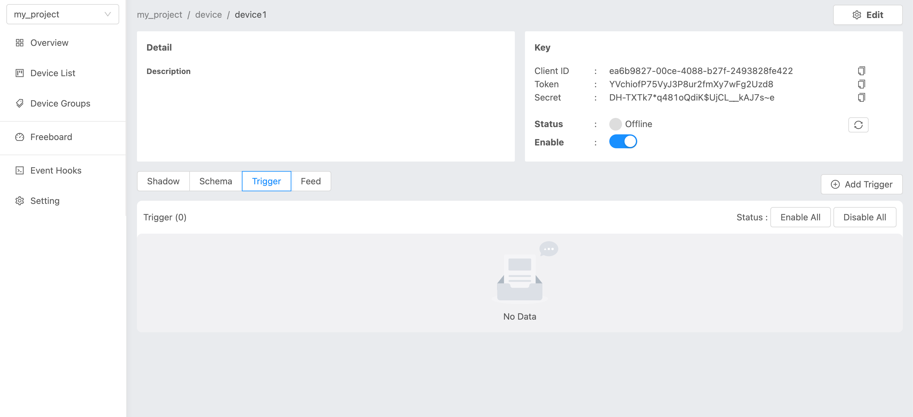
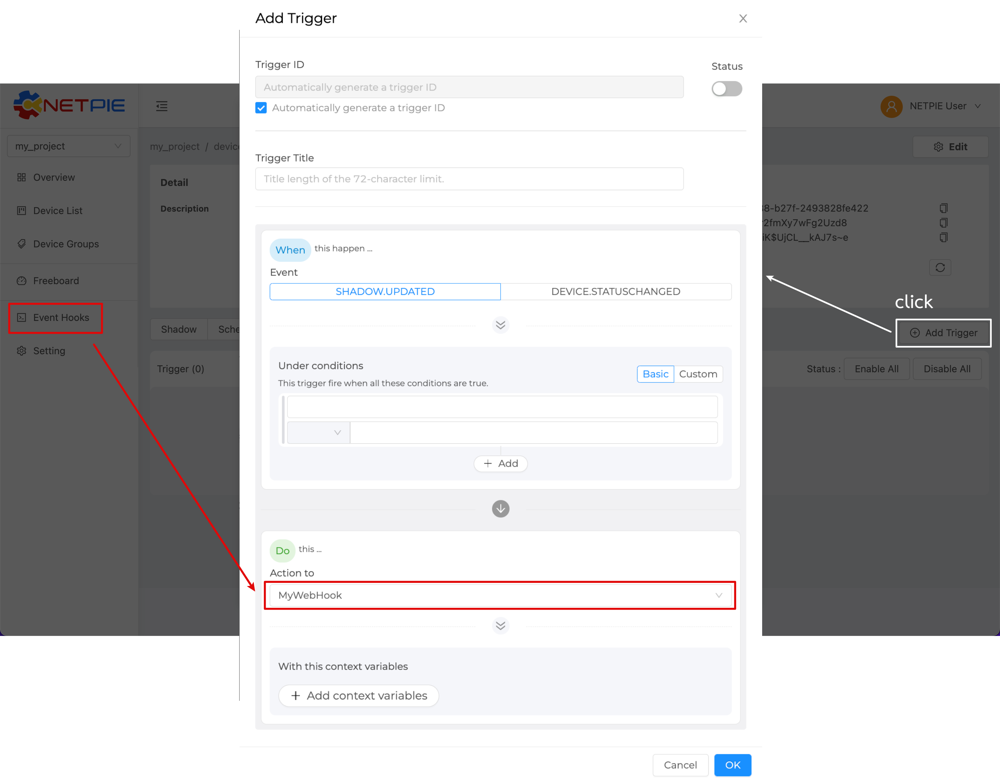
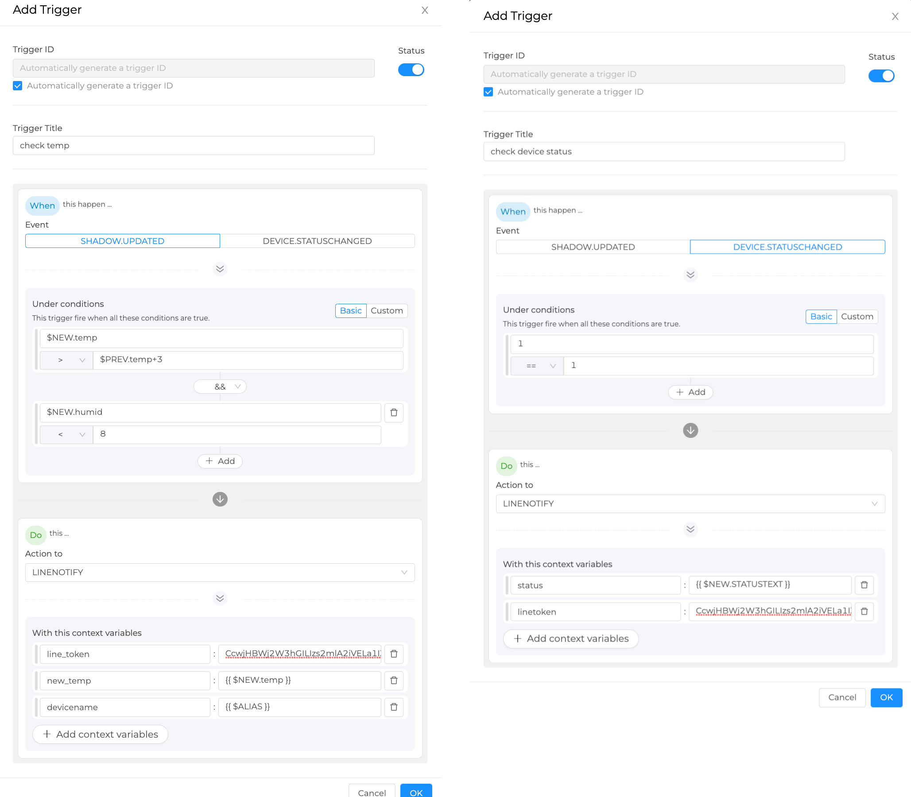
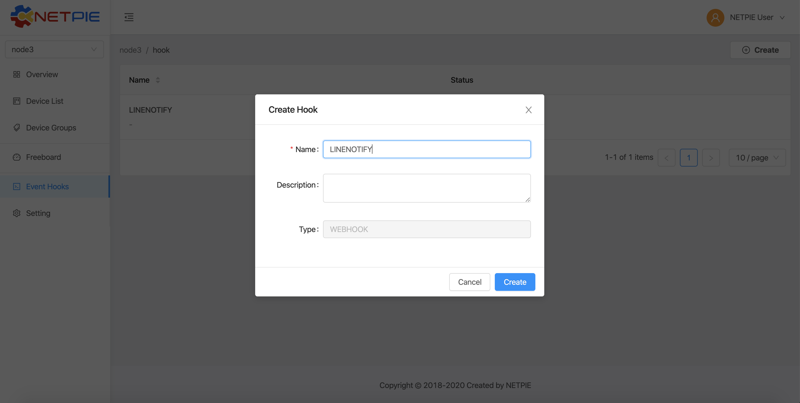
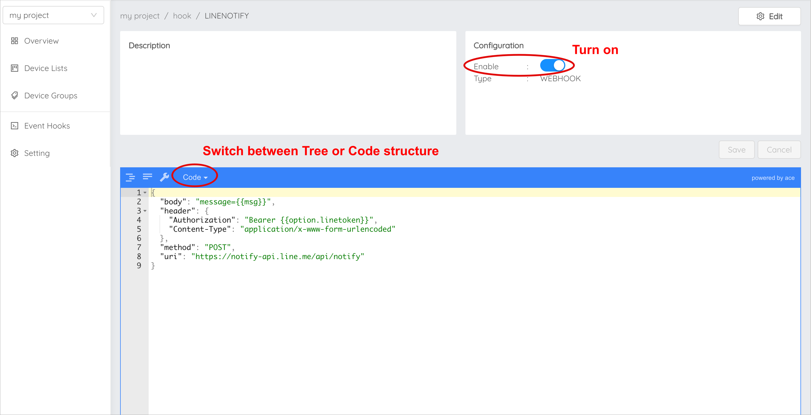

.. raw:: html

    
<a href="https://docs.netpie.io/th/device-config.html">TH</a> | <b>EN</b>

Device Configuration
=====================

|

Device Shadow
------------------

For every device, NETPIE provides a virtual database called “Device Shadow” to store device information such as data generated by sensors and device configuration information.

The device shadow is declared in JSON format, for example,

.. code-block:: json

	{
		"field1" : "value1",
		"field2" : 2,
		"field3" : {
			"subfiled1" : "value3.1",
			"subfiled2" : [1, 2, 3],
			"subfiled3" : {
				"subfiled3.1" : "value3.3.1"
			}
		}
	}

|

Device Schema
------------------

|

Device Schema is associated with the device shadow and NETPIE’s time series database (Feed). It is used for data management purposes. The device schema allows the Server to

- Validate data
- Transform data (such as changing data units)
- Archive data in time series database 

The device schema is declared in JSON format, for example,

.. code-block:: json

	{
	    "additionalProperties": false,
	    "properties": {
	        "temp": {
	            "operation": {
	                "store": {
	                    "ttl": "30d"
	                },
	                "transform": {
	                    "expression": "($.temp * 1.8) + 32"
	                }
	            },
	            "type": "number"
	        },
		    "place": {
		      "operation": {
		        "store": {
		          "ttl": "7m"
		        }
		      },
		      "type": "string"
		    }
	    }
	}

|

Device schema consists of:

:additionalProperties *(boolean)*:
	
	In case the data field specified in “properties” does not match with the received data, then you have the option to save or do not save the received data. This selection is made by setting the value of additionalProperties to true or false.

	``additionalProperties : true`` => Allow all other data fields not specified in “properties” to be saved to shadow or time series database.

	``additionalProperties : false`` => Do not allow other data fields besides those specified in “properties” to be saved.

	.. admonition:: Example

		The schema’s properties are defined as ``temp`` and ``humid``, but the data received contains ``temp``, ``humid``, and ``place``. If ``additionalProperties`` is set to ``true``, the entire data will be saved. If ``additionalProperties`` is set to ``false``, only ``temp`` and ``humid`` data will be saved to the shadow and time series database.

|

:properties *(json)*:

	First, define a field name (such as ``temp`` and ``place``) and then define the property of each field in JSON format.

	- ``operation`` Used for data handling, consisting of:

		``store`` Used for data collection in time series database, consisting of:

			``ttl`` The time period of holding data in the time series database.  Each data point that has reached the holding period is automatically deleted. The configuration includes an integer number followed by unit of time, i.e., ms (millisecond), s (second), m (minute), h (hour), d (day), y (year). In case the unit is unspecified, the default unit ms (millisecond) will be employed. 

			.. admonition:: Example

				30d means storing data for 30 days, 1y means one year, 3000 means 3 seconds.

		``transform`` Used for data transformation before storing it.

			``expression`` Formula or method of transforming data before storing it.

			.. admonition:: Example

				To convert temperature reading into Fahrenheit before storing in a shadow or time series database, multiply degree celsius with 1.8 and add 32 to the result.  ``($.temp * 1.8) + 32``

	- ``type`` Used for specifying data type in the field, i.e., number, string, boolean, array, and object. 
	
|

.. _trigger-and-action:

Device Trigger and Event Hook
-----------------------------

Device Trigger
^^^^^^^^^^^^^^

Device Trigger is a system that binds the change of device information kept in Device Shadow with the external actions defined in Event Hook. For example, in order to set a trigger when the device status has changed, the device trigger management looks like this:

Click on “Add Trigger” button on the right corner to create a new trigger:

- Trigger ID (string) : ID of Trigger (manual or auto generated).
- Status : Set to enable or disable the trigger.
- Trigger Title (string): Trigger name.
- Event : This is for specifying the triggering event. Currently, |platform_name| allows users to monitor and set trigger to two types of events

	- ``SHADOW.UPDATED`` : Trigger will occur when the data in the device shadow changes according to a specified condition.

	- ``DEVICE.STATUSCHANGED`` : Trigger will occurs when the device changes the status on platform from online to offline or vice-versa.

- Under conditions : This is a logical expression used to specify the condition that triggers an action. For example, a trigger will occur when the temperature changes, or when the temperature drops below or rises above a desired value. There are three types of operators that can be used in the condition: numeric, comparison, and boolean.

- Action to : That is, when a trigger occurs, what action will be performed. This can be done by specifying here the name of the Event Hook previously created in the “Event Hooks” menu on the left-hand side of the platform portal.

- With this context variables : This is used for configuring parameters that you want to send along with the trigger.

See example below:

|

Shadow Data Reference in Condition of Trigger
~~~~~~~~~~~~~~~~~~~~~~~~~~~~~~~~~~~~~~~~~~~~~~

- ``$PREV.path.of.data`` => This is the previous value of the data right before the update. It is referred to as a prefix $PREV followed by the path of that data based on its shadow structure.

- ``$NEW.path.of.data`` => This is the new incoming data value. It starts with a prefix $NEW followed by the data path.

- ``$CUR.path.of.data`` => This is used to refer to the current value of the data, which is a result of merging its previous value ($PREV.path.of.data) with the new value ($NEW.path.of.data). It starts with $CUR followed by the path of that data based on its shadow structure.

|

Distinguishing $NEW, $CUR and $PREV in Trigger
~~~~~~~~~~~~~~~~~~~~~~~~~~~~~~~~~~~~~~~~~~~~~~~~

The relationship between these three values can be summarized as: ``$CUR = $PREV merge $NEW``

- ``$PREV`` refers to the previous value kept in the shadow before the update
- ``$NEW`` refers to the new value post to the shadow for an update
- ``$CUR`` refers to the current value in the shadow after the update

Example of how to use $NEW, $CUR and $PREV

``Shadow 1``

.. code-block:: json

	{ 
		"f1": "d1", 
		"f2": ["A", "B", "C"], 
		"f3": { "a1": 1, "a2": 2, "a3": 3 }
	}

``Shadow 2``

.. code-block:: json

	{ 
		"f1": "d1", 
		"f2": "A", 
		"f3": { "a1": 1, "a2": 2, "a3": 3 }
	}

The referencing values using prefix $NEW, $CUR and $PREV are as follows:

- ``$PREV.f1`` => “d1”
- ``$NEW.f1`` => null
- ``$CUR.f1`` => “d1”
- ``$PREV.f2`` => “A”, “B”, “C”
- ``$NEW.f2`` => “A”
- ``$CUR.f2`` => “A”
- ``$PREV.f3`` => {“a1”:1, “a2”:2, “a3”:3}
- ``$NEW.f3`` => null
- ``$CUR.f3`` => {“a1”:1, “a2”:2, “a3”:3}

|

Variables Reference
~~~~~~~~~~~~~~~~~~~~~~~~~~~~~~

- ``$DEVICEID`` => ID of the device to which the shadow belongs.
- ``$ALIAS`` => Name of the device to which the shadow belongs.
- ``$PROJECTID`` => ID of the project to which the shadow belongs.
- ``$PROJECTNAME`` => Name of the project to which the shadow belongs.
- ``$GROUPID`` => ID of the group to which the shadow belongs.
- ``$GROUPNAME`` => Name of the group to which the shadow belongs.
- ``$NEW.STATUS`` => Device’s current status. (‘1’ for online and ‘0’ for offline)
- ``$NEW.STATUSTEXT`` => Device’s current status message. (‘online’ - Connected to platform and ‘offline’ - Disconnected from platform)
- ``$OLD.STATUS`` => Device’s previous status. (‘1’ for online and ‘0’ for offline)
- ``$OLD.STATUSTEXT`` => Device’s previous status message (‘online’ - Connected to platform and ‘offline’ - Disconnected from platform)

|

Operators in Condition of Trigger
~~~~~~~~~~~~~~~~~~~~~~~~~~~~~~~~~~

- ``+`` => Add the value of the numeric operands

- ``-`` => Subtract the value of the succeeding operand from that of the preceding operand

- ``*`` => Multiply the value of the numeric operands

- ``/`` => Divide the value of the succeeding operand to that of the preceding operand

- ``//`` => Divide the value of the succeeding operand to that of the preceding operand and return only the whole number quotient

- ``%`` => Divide the value of the succeeding operand to that of the preceding operand and return only the remainder

- ``^`` => Raise the preceding operand to the power of the succeeding operand

- ``&&`` => Logical AND

- ``||`` => Logical OR

|

Comparison Operators in Condition of Trigger
~~~~~~~~~~~~~~~~~~~~~~~~~~~~~~~~~~~~~~~~~~~~~

- ``==`` => Equal (Value only)

- ``===`` => Equal (Value and Type)

- ``!=`` => Not equal (Value only)

- ``!==`` => Not equal (Value or Type)

- ``>`` => Greater than

- ``>=`` => Greater than or equal

- ``<`` => Less than

- ``<=`` => Less than or equal

- ``in`` => value is contained in a list (Array or String)

|

Event Hook
^^^^^^^^^^^

Event hook is an intermediary used to define what action will take place as a consequence of the condition set in Device Trigger. Therefore, it must be created in tandem with Device Trigger by clicking on the ‘Event Hooks’ sidebar of the platform’s portal as shown in the picture below.

.. image:: _static/event_hooks2.png

Create a new Event Hook by clicking on the “Create” button. Fill in the required (*) information. At present, NETPIE allows only the WEBHOOK type. When you are finished, click the “Create” button and an Event Hook will be created for you as shown below:

Next, click on the name of the Event Hook just created to set up its function using JSON format.

.. code-block:: json

	{
		"body": "message=Temperature of {{context.devicename}} is changed to {{context.temp}}ํC",
  		"header": {
    		"Authorization": "Bearer {{context.linetoken}}",
			"Content-Type": "application/x-www-form-urlencoded"
		},
  		"method": "POST",
  		"uri": "https://notify-api.line.me/api/notify"
	}

From the example above, there are four parameters for the Event Hook to be configured:

- ``body`` the payload message that needs to be sent.

- ``header`` Similar to HTTP Headers, this is the additional information that needs to be sent to the destination like Authorization and Content-Type.

- ``method`` the desired action you request the destination to act upon the message being sent, i.e., GET, POST, or PUT.

- ``uri`` the endpoint of the destination.

Referencing context variable format from the trigger is ``{{context.variable_name}}`` 

.. note:: Referencing data

   	The value of data can be referred mainly in two manners: condition and string. For condition, the data value is used for setting up a logical condition and in such a case you can use the format mentioned above straight away as it has already been demonstrated in the Device Trigger example. However, if you want to show the data value within a string, the variable needs to put in a double braces {{..}}, e.g., {{$NEW.bedroom.temp}}, {{$PREV.bedroom.temp}}.