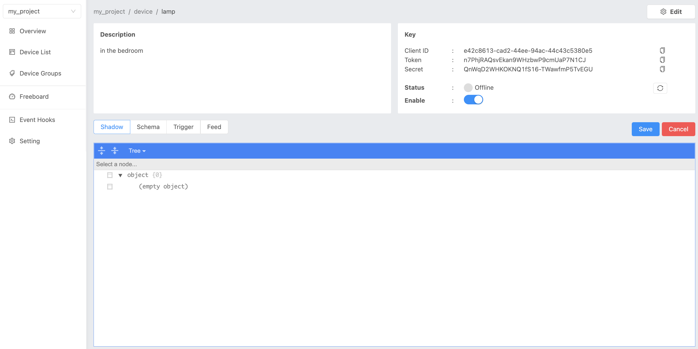

.. raw:: html

    
<a href="https://docs.netpie.io/th/getting-started.html">TH</a> | <b>EN</b>

Getting Started
===============

Creating Project
----------------

Login into the portal at  |portal_url|. The list of all the projects that you have created can be viewed on this page.  If you are logging for the first time, you will see no projects listed:

.. image:: _static/project_list.png

Start creating a project by clicking plus sign  “+” at the bottom of the page:

Fill in the project information. The fields marked with (*) are required. Then click on the “Create” button, and the system will create the project as shown below. Click on the project to continue: 

Create Device
----------------

Upon entering each project, the following project overview screen will appear:

Create a new device by clicking on “Device Lists” in the menu on the left hand side:

Click on “Create” button on the upper right corner to create a new device:

Enter device information, fields marked with (*) are required. Then click on “Create” button, the system will create device as shown below:

By clicking on each device, information associated with the device like Key, Token, and Secret (credentials) can be viewed. This information is used to connect the device to the platform:

.. _key-device-platform:

Connect Device to Platform
-------------------------------------------------

A unique key is required to connect a device to the platform.  The key associated with the device can be viewed on the platform portal as shown below:

.. image:: _static/device_key2.png

To connect the device to the platform using MQTT protocol, the following parameters need to be specified:

.. list-table::
   :widths: 30 50
  
   * - **Host**
     - |broker_url|
   * - **Port**
     - 1883 (mqtt), 1884 (mqtts)
   * - **Client ID**
     - Device ClientID created on NETPIE.
   * - **Username**
     - Device Token created on NETPIE.
   * - **Password**
     - (Not required)

Try connecting to the platform using the MQTT box, which can be downloaded from Chrome Web Store. Open the MQTT box once installed:

Click on “Create MQTT Client” to establish connection with the MQTT server (NETPIE):

.. image:: _static/mqttbox_config.png

Enter the input parameters carefully. Then click the “Save” button, the MQTT box will now connect to the NETPIE platform. If successful, you will see the “Connected” icon in green color as shown below:

Test the connection by publishing a message to yourself. Set the Topic value in Publish and Subscribe to ‘@msg/topic_name’. Click the “Subscribe” button before clicking “Publish”:

|

Communication between Devices
------------------------------

In order for devices to be able to communicate with each other, they must be grouped together. To do so, click “Device Groups” in the menu on the left-hand side:

Create a new group by clicking on the “Create” button and fill in the information:

On successful creation, the newly created group will appear as shown below:

Go back to “Device Lists” and create a second device to try connecting two devices to each other:

.. image:: _static/device_2item.png

Arrange both devices in the newly created group using the steps shown in the below picture:

Once the device is imported to Group, the name of the Group to which the device belongs can be viewed on the Device Lists:

Now, try connecting the second device to the platform using HiveMQ, which can be downloaded from https://github.com/chavee/hivemq-mqtt-web-client. Once the download is completed, extract the .zip folder and open the ‘index.html’ file. Enter the Device’s ClientID in “ClientID” field, Device’s Token in “Username” field, and mqtt.netpie.io in the “Host” field:

Then click the “Connect” button to connect to the NETPIE platform:

Head back to the webpage |portal_url|. You will see both the devices in the Device Lists are now active:

Test communication between these two devices namely “switch” and “lamp”. Connect the “switch” to the platform using HiveMQ and “lamp” using MQTT box:

We will now send the message from “switch” to “lamp”, to turn on/off the light. To do so, set the “switch” to publish a message on topic “@msg/set/status” and set the “lamp” to subscribe to the topic “@msg/set/status”:

