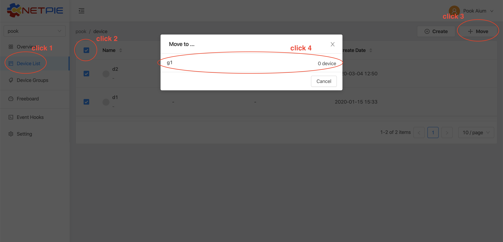
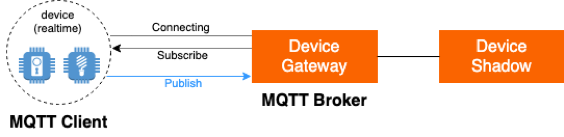

.. raw:: html

    
<a href="https://docs.netpie.io/th/mqtt-api.html">TH</a> | <b>EN</b>

MQTT
======

The connection to the NETPIE platform is established via MQTT (Message Queuing Telemetry Transport), which is a popular protocol for M2M (Machine-to-Machine) communication. Any compatible MQTT client library for your device can be used to connect to NETPIE. In MQTT connection four parameters are required, i.e., Host, ClientID, Username, and Password. Specify each value as follows:

.. rst-class:: left-align-left-col

	.. list-table::
	   :widths: 20 60
	  
	   * - **Host**
	     - |broker_url|
	   * - **Port**
	     - 1883 (mqtt), 1884 (mqtts)
	   * - **Client ID**
	     - Client ID ของ Device ClientID created on |platform_name|
	   * - **Username**
	     - Device Token created on |platform_name|
	   * - **Password**
	     - Device Secret (Optional)

.. image:: _static/device_key2.png

MQTT uses a publish-subscribe model. An MQTT client ‘Publish’ to a topic in order to send information to the platform (MQTT broker) while another MQTT client can ‘Subscribe’ to receive that information on the same Topic. A subscription needs to be made once and the client device will receive the information on the subscribed topic until the device ‘Unsubscribe’ from the Topic or it disconnects from the platform.

.. caution:: 

	Since subscription to a topic will result in receiving only the subsequent information published to the topic, in order for a subscribing client to receive all information, it must subscribe prior to any publication being made to that topic. 

Topic is an important element of MQTT API. Topic will function like an endpoint on the MQTT Broker for MQTT Clients to connect and communicate.  It supports the following features:

- Three levels of QoS (Quality of Service) : QoS is an agreement between the sender (Publisher) and receiver (MQTT Broker) to guarantee the reliability of data delivery.

	- **QoS Level 0** : This level of QoS is also referred to as ‘At most once’. There will be no acknowledgement from the MQTT Broker upon reception of message (data). If need be, client must implement message delivery guarantee at the application level.

	- **QoS Level 1** : This level of QoS is also referred to as ‘At least once’. A response is required to verify that the information has been received by the MQTT Broker. The sender will keep resending until receiving an acknowledgement from the broker. This QoS reassures that the MQTT Broker will receive at least one copy of the data, but at the same time the same data can be delivered more than once.

	- **QoS Level 2** : This level of QoS is also referred to as ‘Exactly once’. Every transmission guarantees that information is sent to the MQTT Broker and is received exactly once by adding one more round of handshake between the client and the broker per one message being sent.

- Shared Subscription : It is the dissemination of data to all clients subscribing to the same topic.

- Transparent Virtual Host : When devices are put in different groups, they are completely separate and will not be able to publish or subscribe to each other even using the same topic name. Therefore, grouping of devices works like hosting them virtually separately while physically they are all on the same platform. 

|

Message API Topic
--------------------

This section is about setting up a Topic for devices to communicate with each other within the same group. To add device to a group, follow the steps below:

When the device is successfully added to a group, use the command publish or subscribe followed by @msg/Topic_structure.

.. rst-class:: left-align-left-col
	
	.. list-table::
	   :widths: 20 60
	  
	   * - **publish**
	     - publish ``@msg/{any}/{topic}``
	   * - **subscribe**
	     - subscribe ``@msg/{any}/{topic}``
	   * - **Example Topics**
	     - ``@msg/myhome/bedroom/lamp``, ``@msg/sensor/temp``, ``@msg/john``

As shown in the example above Topic can be structured in levels separated by forward slash “/”. Two types of wildcard topics are also supported, but only for subscription.

1.  **Multi-level Wildcard** The multi-level wildcard must be placed at the end of the topic. When a client subscribes to a topic with a multi-level wildcard, it will receive every message published to every topic starting with the pattern before the wildcard. See example:

.. rst-class:: left-align-left-col

	================================== ========================================
	Subscribe to Topic                 Topics from which to receive messages
	================================== ========================================
	``@msg/#``                         @msg/{any single-level or multiple-level paths}, e.g., ``@msg/myhome``, ``@msg/myhome/bedroom/lamp``, ``@msg/john``
	``@msg/rooms/#``                   @msg/rooms/{any single-level or multiple-level paths}, e.g., ``@msg/rooms``, ``@msg/rooms/bathroom``, ``@msg/rooms/bedroom/lamp``
	================================== ========================================

2. **Single-level Wildcard** The single-level wildcard is used to represent one level within a topic. When a client subscribes to a topic containing a single-level wildcard, it will receive every message published to every topic with the pattern before and after the wildcard. See example:

.. rst-class:: left-align-left-col

	================================== ========================================
	Subscribe to Topic                 Information to receive on Topic
	================================== ========================================
	``@msg/+``                         @msg/{any single-level paths}, e.g., ``@msg/myhome``, ``@msg/temp``, ``@msg/room``
	``@msg/rooms/+``                   @msg/room/{any single-level paths}, e.g., ``@msg/rooms/bathroom``, ``@msg/rooms/bedroom``, ``@msg/rooms/kitchen``
	``@msg/home/+/light``              @msg/home/{any single-level paths}/light, e.g., ``@msg/home/bathroom/light``, ``@msg/home/livingroom/light``, ``@msg/home/garage/light``
	``@msg/home/+/+/door``             @msg/home/{any single-level paths}/{any single-level paths}/door, e.g.,}/door เช่น ``@msg/home/john/bedroom/door``, ``@msg/home/upstairs/bathroom/door``
	================================== ========================================
|

.. note:: Wildcard Topic

	- The multi-level wildcard “#” sign  must always be placed at the end of the topic only.
	- The multi-level “#” wildcard sign can be a substitution of a null string while the single-level “+” sign must be used to substitute a string representing a single level path. For example, subscription to topic ``@msg/bedroom/#`` will result in the reception of messages from topic @msg/bedroom. On the contrary, client subscribing to topic ``@msg/bedroom/+`` will not receive messages from ``@msg/bedroom``.
	- The “#” and “+” signs can be used together, but still the “#” sign should always be at the end. For example, ``@msg/home/+/bathroom/#``.

|

Shadow API Topic
--------------------

In addition to communication with other devices in the same group, a device can communicate with Device Shadow by publishing and subscribing to topics starting with some certain prefixes. Device can publish to the shadow in order to update the data in the shadow or to request information. Subscription is used to receive the information that the device publishes to request or the information change. There are two types of topics involving Device Shadow:

1. **Private Channel Topic** It is a special channel for device to receive information on changes in its own shadow like data being updated; hence devices can only subscribe to this type of topic. The topic format starts with @private followed by response topic. At present, the response topics in the private channel device can subscribe to consist of:

.. rst-class:: left-align-left-col

	==============================================================  ============================================================
	Subscribe Topic                                                 Description
	==============================================================  ============================================================
	``@private/#``                                                  Wait to receive all information on the topic beginning with “@private/”. Note that any notification from the platform will be published to this topic as well.
	``@private/shadow/data/get/response``                           Wait to receive device shadow information, when it is requested.
	==============================================================  ============================================================
		
2. **Shadow Topic** It is a channel for a device to manage its own device shadow. Devices can only publish to the type of topic. Currently, there are two topics device can publish to in this channel:

.. rst-class:: left-align-left-col

	=========================================================  ==================================================
	Publish Topic                                              คำอธิบาย
	=========================================================  ==================================================
	``@shadow/data/get`` 		                               Publish to request all of device’s own shadow. data to get information. It’s response will be received on the Subscribe Topic ``@private/#`` or ``@private/shadow/data/get/response``
	``@shadow/data/update``            						   Used to update value in the shadow. Send a payload as follows: 

															   .. code-block:: json
															   
															   		{ 
															   			"data":{ 
															   				"field name 1": value 1, 
															   				"field name 2": value 2, ..., 
															   				"field name n": value n 
															   			}
															   		}

	=========================================================  ==================================================

.. tip:: 

	If you want to customize the timing of saved points in the Time Series database, you can set it in the Device Schema by mentioning time-stamp in the message payload. For example, 

	|

	MQTT topic : @shadow/data/update
	
	MQTT payload : { "data" : { "temp" : 21.5 }, "timestamp": 1566450000000 }

	|

	Provided that, if the time-stamp entered is older than the last time-stamp specified in shadow data, the value will not be updated in the shadow data. And, if the Trigger is set, the Trigger will not be activated.