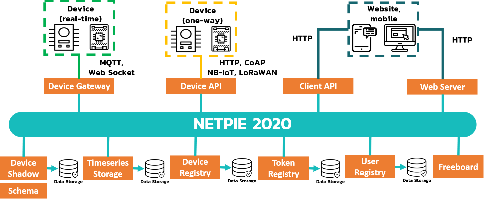

.. raw:: html

    
<a href="https://docs.netpie.io/th/overview-netpie.html">TH</a> | <b>EN</b>

Overview
====================

NETPIE 2020 is the latest version of IoT cloud-based platform-as-a-service developed to meet the needs of commercial users such as IoT device manufacturers, industries, and enterprises. The platform helps connect your IoT devices together seamlessly by pushing the complexity from the hands of application developers or device manufacturers to the cloud.  The new version of the platform with a bunch of new features was launched in 2020 with an aim to shorten and ease the process of IoT product development.

|

**Main features of NETPIE 2020**

	1. Monitoring - Real-time display of data from sensors and/or devices.

	2. Controlling - Control the operation of various devices via the cloud platform.
	
	3. Data Storage - Store the data collected from sensors and/or devices.
	
	4. Notification - Receive alerts on device status that has malfunctioned.
	
	5. Dashboard - Visualize the sensor data and control the operation of devices through dashboard.

